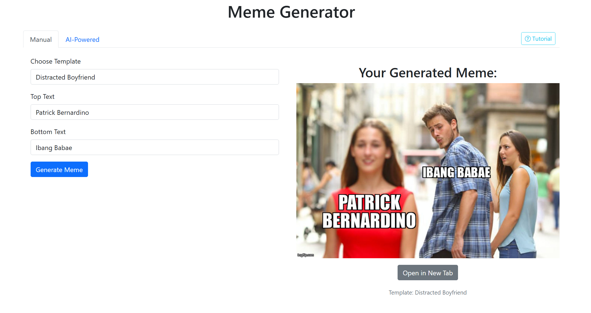

# Meme Generator with MCP


### 🔗 [View AI Demo](http://67.217.58.19:8080/ai/)


A powerful meme generator application that combines Django, Docker, and AI capabilities to create and manage memes.

## Quick Installation (Docker Hub)

The easiest way to get started is using our Docker Hub image. Here's how to deploy it to your VPS or EC2 instance:

1. **SSH into your server**:
```bash
ssh your_username@your_server_ip
```

2. **Create project directory**:
```bash
mkdir -p ~/meme-generator
cd ~/meme-generator
```

3. **Create required directories**:
```bash
mkdir -p data/{static,media} \
        logs/{nginx,app} \
        nginx/conf.d \
        ssl \
        backups
```

4. **Create docker-compose.yml**:
```bash
cat > docker-compose.yml << 'EOL'
version: '3.8'

services:
  web:
    image: dadidelux/mcp-meme-generator:latest
    command: gunicorn mysite.wsgi:application --bind 0.0.0.0:8000 --workers=4 --threads=2
    volumes:
      - ./data/static:/app/staticfiles
      - ./data/media:/app/media
    expose:
      - 8000
    env_file:
      - .env.prod
    depends_on:
      - db
      - redis
    restart: unless-stopped

  db:
    image: postgres:15
    volumes:
      - postgres_data:/var/lib/postgresql/data
    environment:
      - POSTGRES_DB=${DB_NAME}
      - POSTGRES_USER=${DB_USER}
      - POSTGRES_PASSWORD=${DB_PASSWORD}
    restart: unless-stopped

  redis:
    image: redis:7-alpine
    command: redis-server --requirepass ${REDIS_PASSWORD}
    volumes:
      - redis_data:/data
    restart: unless-stopped

  nginx:
    image: nginx:1.25-alpine
    volumes:
      - ./data/static:/app/staticfiles
      - ./data/media:/app/media
      - ./nginx/conf.d:/etc/nginx/conf.d
      - ./ssl:/etc/nginx/ssl
      - ./logs/nginx:/var/log/nginx
    ports:
      - "80:80"
      - "443:443"
    depends_on:
      - web
    restart: unless-stopped

volumes:
  postgres_data:
  redis_data:
EOL
```

5. **Create environment file**:
```bash
cat > .env.prod << 'EOL'
DJANGO_SECRET_KEY=your-secret-key-here
DJANGO_ALLOWED_HOSTS=your-ip-or-domain,localhost,127.0.0.1
DEBUG=0
DB_NAME=django_db
DB_USER=django_user
DB_PASSWORD=your-secure-db-password
DB_HOST=db
REDIS_HOST=redis
REDIS_PASSWORD=your-secure-redis-password
EOL
```

6. **Create Nginx configuration**:
```bash
cat > nginx/conf.d/app.conf << 'EOL'
upstream web {
    server web:8000;
}

server {
    listen 80;
    listen [::]:80;
    server_name _;

    location / {
        proxy_pass http://web;
        proxy_set_header X-Forwarded-For $proxy_add_x_forwarded_for;
        proxy_set_header Host $host;
        proxy_redirect off;
    }

    location /static/ {
        alias /app/staticfiles/;
    }

    location /media/ {
        alias /app/media/;
    }
}
EOL
```

7. **Start the application**:
```bash
docker-compose pull
docker-compose up -d
```

Your meme generator should now be running at `http://your-server-ip`!

## Maintenance Commands

- **View logs**:
  ```bash
  docker-compose logs -f
  ```

- **Restart services**:
  ```bash
  docker-compose restart
  ```

- **Stop everything**:
  ```bash
  docker-compose down
  ```

- **Update to latest version**:
  ```bash
  docker-compose pull
  docker-compose up -d
  ```

## Features

- AI-powered meme generation
- Multiple meme templates
- Docker containerization
- Production-ready setup
- Nginx reverse proxy
- Redis caching
- PostgreSQL database

## Docker Hub Repository

The Docker image is available at: [dadidelux/mcp-meme-generator](https://hub.docker.com/repository/docker/dadidelux/mcp-meme-generator/general)

## Local Development

For local development instructions and more detailed documentation, see [DEVELOPMENT.md](DEVELOPMENT.md)

## License

This project is licensed under the MIT License - see the [LICENSE](LICENSE) file for details.
